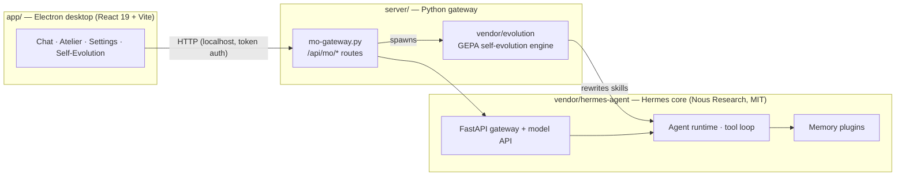

<h1 align="center">貘 · Mo</h1>
<h3 align="center">A desktop self-evolving agent.</h3>

<p align="center">
  A local-first desktop agent that doesn't just run tasks — it rewrites its own skills overnight to get better at them. Built on the <a href="https://github.com/NousResearch/hermes-agent">Hermes Agent</a> core, wrapped in a calm, paper-textured desktop app.
</p>

<p align="center">
  <a href="LICENSE"></a>
  
  
  
  
</p>

---

## What makes Mo different

Most agents are static: the prompt and skills you ship are the prompt and skills you keep. **Mo evolves.** It records the trajectories of the work it does for you, then — on a schedule or on demand — runs a [GEPA](https://arxiv.org/abs/2507.19457)-style optimization loop that rewrites one of its own skills, validates the new version against synthetic evaluations and hard constraints, and only deploys it if it genuinely scores better.

The result is an agent whose competence is not frozen at install time. The skills you use most get sharper the more you use them.

- 🧬 **Self-evolving skills** — a nightly optimizer rotates through your custom skills, improving them one at a time. Every candidate must beat the baseline on a generated eval set and pass size / growth / structure constraints before it ships.
- 🖥️ **Real desktop agent** — chat, terminal, file access and a tool-calling loop, powered by the Hermes Agent core.
- 🏠 **Local-first & private** — point it at local models (Ollama) or any OpenAI-compatible endpoint. Your memory and trajectories stay on your machine.
- 🧠 **Persistent memory** — long-term semantic memory via a pluggable backend (OpenViking), with recall tuned to skip trivial messages.
- 🎛️ **Configure once, then just pick** — an endpoint library lets you register a provider once and select models per scenario (chat / embedding / evolution / fine-tuning).
- 🔬 **Fine-tuning scaffold** — collect trajectories and turn them into datasets for model fine-tuning.

## Architecture



- **`app/`** — the desktop application. Its own React UI; talks to the gateway over localhost with a per-boot token.
- **`server/`** — the Python gateway (`mo-gateway.py`) that mounts Mo's `/api/mo/*` routes onto the Hermes web server, plus the self-evolution engine under `server/vendor/evolution/`.
- **`vendor/hermes-agent/`** — the vendored Hermes Agent core (Nous Research, MIT). See [Licensing](#licensing).

See [docs/architecture.md](docs/architecture.md) and [docs/self-evolution.md](docs/self-evolution.md) for details.

## Quick start

**Prerequisites**

- macOS (Apple Silicon)
- Node.js ≥ 18
- Python 3.11 with the Hermes core dependencies installed (see [docs/configuration.md](docs/configuration.md))

**Run in development**

```bash
# 1. One-time setup: app deps + Python venv for the vendored core
./scripts/setup.sh

# 2. Launch the app (builds main + renderer, then starts Electron)
cd app
npm run dev
```

The app spawns `server/mo-gateway.py`, which boots the Hermes gateway and the Mo API, then connects the UI automatically.

**Configuration** lives in `~/.hermes-mo/` (config, memory, sessions, trajectories). Copy `.env.example` to `~/.hermes-mo/.env` and fill in your model provider keys. See [docs/configuration.md](docs/configuration.md).

## Build a distributable

```bash
cd app
npm run dist:local   # unsigned local build → app/release/
```

Packaging bundles `server/` and `vendor/hermes-agent/` into the app's resources.

## Status

**Alpha**, macOS (Apple Silicon) only for now. APIs and layout may change. Issues and PRs welcome.

## Contributing

See [CONTRIBUTING.md](CONTRIBUTING.md) for project layout and development setup, and [CODE_OF_CONDUCT.md](CODE_OF_CONDUCT.md). Notable changes are tracked in [CHANGELOG.md](CHANGELOG.md).

## Licensing

Mo is released under the **[MIT License](LICENSE)**.

It bundles the **Hermes Agent** core by **Nous Research**, also MIT-licensed. That copyright notice is preserved in `vendor/hermes-agent/LICENSE`, and the attribution is recorded in [NOTICE](NOTICE) and [THIRD_PARTY_LICENSES/](THIRD_PARTY_LICENSES/). Mo's own components — the self-evolution engine, the gateway extensions, and the desktop app — are original work.

## Acknowledgements

Built on the excellent [Hermes Agent](https://github.com/NousResearch/hermes-agent) by [Nous Research](https://nousresearch.com). Self-evolution is inspired by the [GEPA](https://arxiv.org/abs/2507.19457) reflective prompt-optimization approach.
