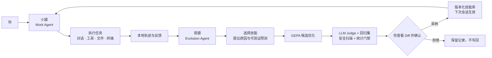
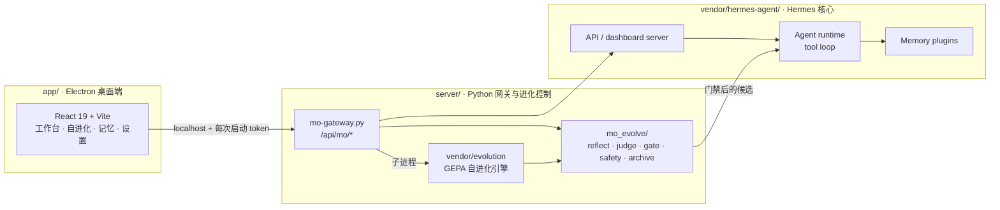

<h1 align="center">貘 · Mo</h1>
<h3 align="center">双 Agent 协作引擎驱动的本地桌面智能体</h3>

<p align="center">
  <strong>小貘负责把事情做完，夜貘负责让它下一次做得更好。</strong>
</p>

<p align="center">
  <strong>简体中文</strong> · <a href="README_EN.md">English</a>
</p>

<p align="center">
  <a href="LICENSE"></a>
  
  
  
  
  
</p>

<p align="center">
  貘是一款本地优先的桌面 Agent：白天由<strong>小貘</strong>执行任务，夜间由<strong>夜貘</strong>复盘真实轨迹、打磨技能。<br>
  所有候选改动都要经过评测、门禁和你的确认，才会进入下一次会话。
</p>


---

## 双 Agent 引擎架构

貘的核心不是“接两个模型”，而是两个职责、状态与交接边界清晰的 Agent 协作：

| Agent | 角色 | 主要职责 | 输出 |
|---|---|---|---|
| **小貘 · Work Agent** | 本体 / `default` profile | 对话、工具调用、终端与文件任务；记录真实执行轨迹和反馈 | 任务结果、会话、轨迹标本 |
| **夜貘 · Evolution Agent** | 进化分身 / `ye-mao-evolve` profile | 阅读轨迹摘要、选择待优化技能、说明原因并提出可验证预测；驱动 GEPA 技能优化 | 待审候选、评测证据、进化记录 |

两者共享 Hermes Agent 核心、本地技能库、记忆和轨迹数据，但权限并不相同：**夜貘不能绕过你直接部署技能改写**。



这套架构有四个关键点：

- **角色分离**：工作 Agent 专注完成当前任务，进化 Agent 专注复盘与改进。
- **真实交接**：小貘产生的本地轨迹与好评 / 差评，是夜貘的评测材料。
- **证据门禁**：候选必须经过同一批 holdout 样本、LLM Judge、回归 pins、安全约束与统计门禁。
- **人类最终控制**：没有自动部署；每次采纳都有快照，可以查看、拒绝和回退。

> 这里的“双 Agent 引擎”指运行在同一 Hermes 核心与本地状态之上的两个协作 Agent 角色 / profile，不是两个彼此隔离的原生 Agent 运行时。夜貘当前的夜间选题仍是一次受控的 LLM 反思调用，而不是拥有完整工具权限的独立 Agent turn；详见[当前边界](#当前状态与边界)。

## 界面预览

### 自进化中心

统一查看待确认事项、轨迹标本、最近进化、失败记录和已经确认的成长节点。


### 夜貘技艺进化

手动选择技能，或让夜貘挑选目标；候选、日志、历史版本与回退入口全部留在本机。


## 为什么貘不只是另一个聊天壳

- 🐾 **双 Agent 协作** — 小貘执行，夜貘复盘；工作与改进形成闭环。
- 🧬 **技能自进化** — 按计划或按需运行 GEPA 风格优化，一次只打磨一项技能。
- 🧪 **用你的真实轨迹评测** — 好评、差评和真实会话进入成对评测，不只依赖合成样本。
- 🛡️ **有门禁，不裸奔** — 统计显著性、回归 pins、大小 / 结构 / 增长约束和 diff 范围注入扫描共同决定候选是否可采纳。
- 👁️ **改动先给人看** — 自动流程只生成候选，不自动部署；所有采纳都有快照并可回退。
- 📚 **教它一手** — 从目录、URL 或当前对话生成技能草稿，确认后再进入真实技能库。
- 🧹 **技能退休也要确认** — 将 Hermes 的自动归档改为提案，展示长期未使用技能及其 prompt 成本。
- 🖥️ **真正的桌面 Agent** — 基于 Hermes Agent 核心，支持聊天、工具调用、终端与文件访问。
- 🏠 **本地优先** — 会话、记忆、轨迹和进化记录存放在你的机器上；支持 Ollama 和 OpenAI-compatible endpoint。
- 🧠 **持久记忆** — 通过可插拔后端提供长期语义记忆，参考实现使用 OpenViking。
- 🎛️ **模型按场景配置** — 一次登记 endpoint，再分别选择对话、Embedding、进化与微调模型。
- 🔬 **模型微调脚手架** — 可收集轨迹、生成数据集并记录运行；当前版本不包含云训练脚本。

> **界面语言：**当前桌面 UI 仅提供中文。代码、提交与部分开发文档使用英文，欢迎贡献 i18n。

## 工程架构



- **`app/`** — Electron 桌面应用与 React UI，通过 localhost 和每次启动生成的 token 访问后端。
- **`server/`** — Python 网关；把貘的 `/api/mo/*` 路由挂载到 Hermes Web 服务，并实现评审、门禁、版本归档和安全扫描。
- **`server/vendor/evolution/`** — 带有貘本地改动的 GEPA 自进化引擎。
- **`vendor/hermes-agent/`** — vendored Hermes Agent 核心（Nous Research，MIT）。

进一步阅读：[架构说明](docs/architecture.md) · [自进化机制](docs/self-evolution.md) · [配置说明](docs/configuration.md)

## 快速开始

### 前置要求

- macOS（Apple Silicon）
- Node.js ≥ 18
- Python 3.11

### 开发模式运行

```bash
# 1. 首次安装：应用依赖 + vendored Hermes Python 环境
./scripts/setup.sh

# 2. 构建并启动 Electron
cd app
npm run dev
```

应用会启动 `server/mo-gateway.py`，拉起 Hermes gateway 与貘 API，并自动把桌面 UI 连接到本机服务。

运行数据默认保存在 `~/.hermes-mo/`。将 `.env.example` 复制为 `~/.hermes-mo/.env`，再填写模型服务配置；详见[配置说明](docs/configuration.md)。

## 构建本地安装包

```bash
cd app
npm run dist:local
```

未签名的本地构建会输出到 `app/release/`，其中包含 `server/` 与 `vendor/hermes-agent/`。

## 当前状态与边界

项目当前处于 **Alpha**，仅支持 macOS Apple Silicon，API 与界面仍可能变化。

| 项目 | 当前边界 |
|---|---|
| 平台 | 暂无 Windows / Linux 构建。 |
| UI 语言 | 仅中文。 |
| 双 Agent | 小貘是完整工作 Agent；夜貘拥有独立 profile，但夜间目标选择目前是一次基于预制摘要的 LLM 调用，不能自行读取文件或使用工具验证猜想。 |
| 夜貘能力 | 当前只优化已有技能，不能主动拆分、创建或退休技能；这些流程仍由你发起。 |
| 模型微调 | 仅脚手架，不包含云训练脚本。 |
| 自动化测试 | `server/mo_evolve/` 有离线 pytest 覆盖；网关路由、Electron main process 与 UI 目前没有完整自动化覆盖。CI 额外执行 typecheck、build、引擎导入和许可证检查。 |
| 网络 | UI 启动时会请求 Google Fonts。会话、记忆和轨迹不会因此上传；如需完全离线，请自行托管字体。 |
| 自进化风险 | 候选经过硬约束、diff 范围安全扫描和统计门禁，但模型仍可能受 prompt injection 影响；采纳前应查看 Diff。 |

## 安全

请按照 [SECURITY.md](SECURITY.md) 私下报告安全问题，不要公开提交漏洞 Issue。

## 参与贡献

开发环境与目录说明见 [CONTRIBUTING.md](CONTRIBUTING.md)，社区规范见 [CODE_OF_CONDUCT.md](CODE_OF_CONDUCT.md)，重要变更记录在 [CHANGELOG.md](CHANGELOG.md)。

## 许可证与致谢

貘使用 [MIT License](LICENSE) 发布。

项目内置两个由 **Nous Research** 以 MIT 许可发布的组件：

- [Hermes Agent](https://github.com/NousResearch/hermes-agent) 核心：`vendor/hermes-agent/`
- Hermes Agent Self-Evolution 引擎：`server/vendor/evolution/`，貘的本地修改记录在 [`server/vendor/README.md`](server/vendor/README.md)

版权声明与第三方归属保留在 [NOTICE](NOTICE) 和 [THIRD_PARTY_LICENSES/](THIRD_PARTY_LICENSES/) 中。自进化设计受到 [GEPA](https://arxiv.org/abs/2507.19457) 反思式提示优化方法的启发。
