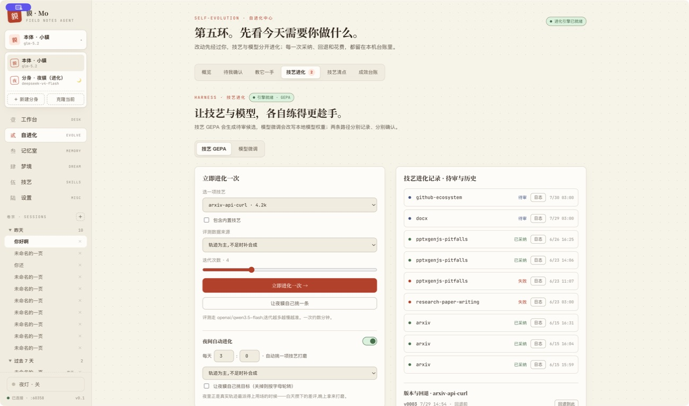
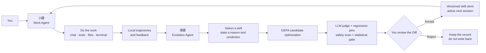
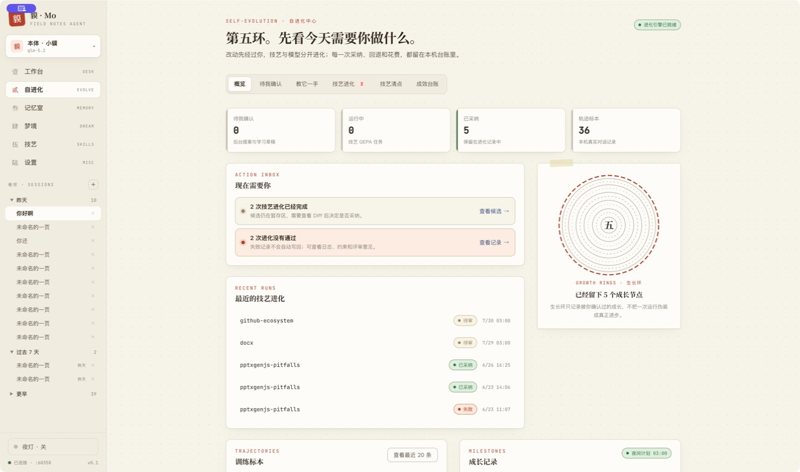
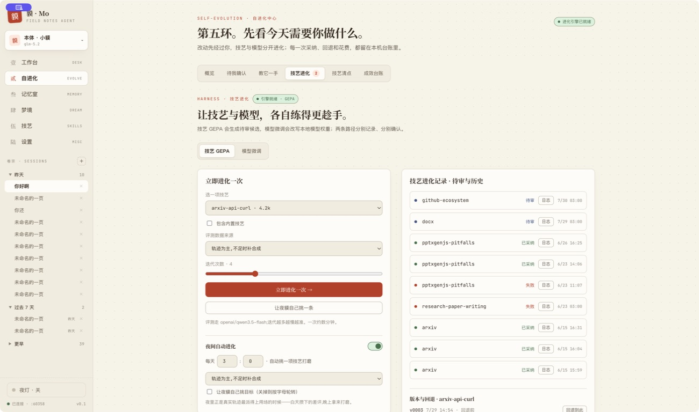
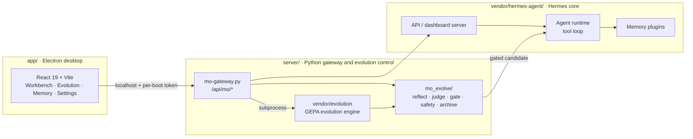

<h1 align="center">貘 · Mo</h1>
<h3 align="center">A local desktop agent powered by a dual-agent collaboration engine</h3>

<p align="center">
  <strong>小貘 gets the work done. 夜貘 makes it better the next time.</strong>
</p>

<p align="center">
  <a href="README.md">简体中文</a> · <strong>English</strong>
</p>

<p align="center">
  <a href="LICENSE"></a>
  
  
  
  
  
</p>

<p align="center">
  Mo is a local-first desktop agent. <strong>小貘</strong> handles your work during the day; <strong>夜貘</strong> reviews real trajectories and improves skills at night.<br>
  Every proposed change must pass evaluation and safety gates—and receive your approval—before it can affect a future session.
</p>



---

## Dual-agent engine

Mo is not merely a UI that calls two models. It separates work and improvement into two agents with explicit roles, state, and handoff boundaries:

| Agent | Role | Responsibilities | Output |
|---|---|---|---|
| **小貘 · Work Agent** | Primary / `default` profile | Chat, tool calls, terminal and file tasks; records real execution trajectories and feedback | Task results, sessions, trajectory specimens |
| **夜貘 · Evolution Agent** | Evolver / `ye-mao-evolve` profile | Reads trajectory summaries, selects a skill, explains why, makes a testable prediction, and drives GEPA skill optimization | Reviewable candidates, evaluation evidence, evolution records |

Both agents share the Hermes Agent core, local skills, memory, and trajectory store, but they do not share the same authority: **夜貘 cannot bypass you and deploy a skill rewrite on its own**.



The design has four important properties:

- **Role separation** — the Work Agent focuses on the current task; the Evolution Agent focuses on retrospective improvement.
- **A real handoff** — local trajectories plus positive and negative feedback become evaluation material.
- **Evidence gates** — candidates face paired holdouts, an LLM judge, regression pins, safety constraints, and a statistical acceptance gate.
- **Human control** — nothing auto-deploys; every accepted version is snapshotted, inspectable, rejectable, and reversible.

> In this repository, “dual-agent engine” means two collaborating agent roles/profiles on a shared Hermes core and local state—not two isolated native agent runtimes. 夜貘's current nightly target selection is a controlled LLM reflection call, not a fully tool-enabled independent agent turn. See [Status and boundaries](#status-and-boundaries).

## Screenshots

### Self-evolution center

Review pending actions, trajectory specimens, recent evolution runs, failures, and user-approved growth milestones.



### 夜貘 skill evolution

Choose a skill yourself or let 夜貘 pick a target. Candidates, logs, version history, and rollback controls stay local.



## More than another chat shell

- 🐾 **Dual-agent collaboration** — 小貘 executes; 夜貘 reflects; work and improvement form a closed loop.
- 🧬 **Self-evolving skills** — run GEPA-style optimization on a schedule or on demand, one skill at a time.
- 🧪 **Evaluation on your real trajectories** — positive feedback, negative feedback, and actual sessions enter paired evaluation instead of relying only on synthetic examples.
- 🛡️ **Gated improvement** — statistical significance, regression pins, size / structure / growth constraints, and a diff-scoped injection scan determine whether a candidate is eligible.
- 👁️ **Human review first** — automation creates candidates, never automatic deployments; every acceptance is snapshotted and reversible.
- 📚 **Teach it a trick** — draft a skill from a directory, URL, or the current conversation, then review it before it reaches the real skill store.
- 🧹 **Retirement requires approval** — Hermes' automatic archiving becomes a proposal that shows unused skills and their always-on prompt cost.
- 🖥️ **A real desktop agent** — chat, tool use, terminal, and file access powered by the Hermes Agent core.
- 🏠 **Local-first** — sessions, memory, trajectories, and evolution records stay on your machine; connect Ollama or any OpenAI-compatible endpoint.
- 🧠 **Persistent memory** — long-term semantic memory through a pluggable backend; the reference setup uses OpenViking.
- 🎛️ **Models by scenario** — register an endpoint once, then choose models for chat, embeddings, evolution, and fine-tuning separately.
- 🔬 **Fine-tuning scaffold** — collect trajectories, build datasets, and keep a run ledger; cloud training scripts are not bundled in this build.

> **UI language:** the desktop UI is currently Chinese-only. Code, commits, and some developer documentation are in English; i18n contributions are welcome.

## System architecture



- **`app/`** — the Electron desktop app and React UI; it talks to the backend over localhost with a per-boot token.
- **`server/`** — the Python gateway; it mounts Mo's `/api/mo/*` routes onto the Hermes web service and implements review, acceptance gates, version archives, and safety scanning.
- **`server/vendor/evolution/`** — the GEPA self-evolution engine with Mo-local changes.
- **`vendor/hermes-agent/`** — the vendored Hermes Agent core (Nous Research, MIT).

Read more: [Architecture](docs/architecture.md) · [Self-evolution](docs/self-evolution.md) · [Configuration](docs/configuration.md)

## Quick start

### Prerequisites

- macOS on Apple Silicon
- Node.js ≥ 18
- Python 3.11

### Run in development

```bash
# 1. One-time setup: application dependencies + vendored Hermes Python environment
./scripts/setup.sh

# 2. Build and launch Electron
cd app
npm run dev
```

The application starts `server/mo-gateway.py`, boots the Hermes gateway and Mo API, and connects the desktop UI to the local services automatically.

Runtime data lives in `~/.hermes-mo/`. Copy `.env.example` to `~/.hermes-mo/.env`, add your model provider configuration, and see [Configuration](docs/configuration.md) for details.

## Build a local distributable

```bash
cd app
npm run dist:local
```

The unsigned local build is written to `app/release/` and bundles `server/` plus `vendor/hermes-agent/`.

## Status and boundaries

Mo is currently **Alpha** and supports macOS on Apple Silicon only. APIs and UI may change.

| Area | Current boundary |
|---|---|
| Platform | No Windows or Linux build yet. |
| UI language | Chinese only. |
| Dual agents | 小貘 is a full Work Agent. 夜貘 has a dedicated profile, but nightly target selection is currently one LLM call over a prepared summary; it cannot inspect files or use tools to validate a hypothesis. |
| 夜貘 capabilities | It currently improves existing skills only. It cannot independently split, author, or retire skills; you initiate those workflows. |
| Fine-tuning | Scaffold only; cloud training scripts are not bundled. |
| Automated tests | `server/mo_evolve/` has offline pytest coverage. Gateway routes, the Electron main process, and the UI do not yet have complete automated coverage. CI also runs typecheck, build, engine import, and license checks. |
| Network | The UI requests Google Fonts at launch. Chats, memory, and trajectories are not uploaded by that request; self-host the fonts for a fully offline build. |
| Self-evolution risk | Candidates pass hard constraints, a diff-scoped safety scan, and a statistical gate, but prompt injection can still influence model-written skill text. Review the Diff before accepting. |

## Security

Please report vulnerabilities privately as described in [SECURITY.md](SECURITY.md). Do not open a public issue for a security problem.

## Contributing

See [CONTRIBUTING.md](CONTRIBUTING.md) for the project layout and development setup, [CODE_OF_CONDUCT.md](CODE_OF_CONDUCT.md) for community guidelines, and [CHANGELOG.md](CHANGELOG.md) for notable changes.

## License and acknowledgements

Mo is released under the [MIT License](LICENSE).

It bundles two MIT-licensed components from **Nous Research**:

- the [Hermes Agent](https://github.com/NousResearch/hermes-agent) core in `vendor/hermes-agent/`
- the Hermes Agent Self-Evolution engine in `server/vendor/evolution/`, with Mo-local changes documented in [`server/vendor/README.md`](server/vendor/README.md)

Copyright notices and third-party attributions are preserved in [NOTICE](NOTICE) and [THIRD_PARTY_LICENSES/](THIRD_PARTY_LICENSES/). The evolution design is inspired by the [GEPA](https://arxiv.org/abs/2507.19457) reflective prompt-optimization approach.
