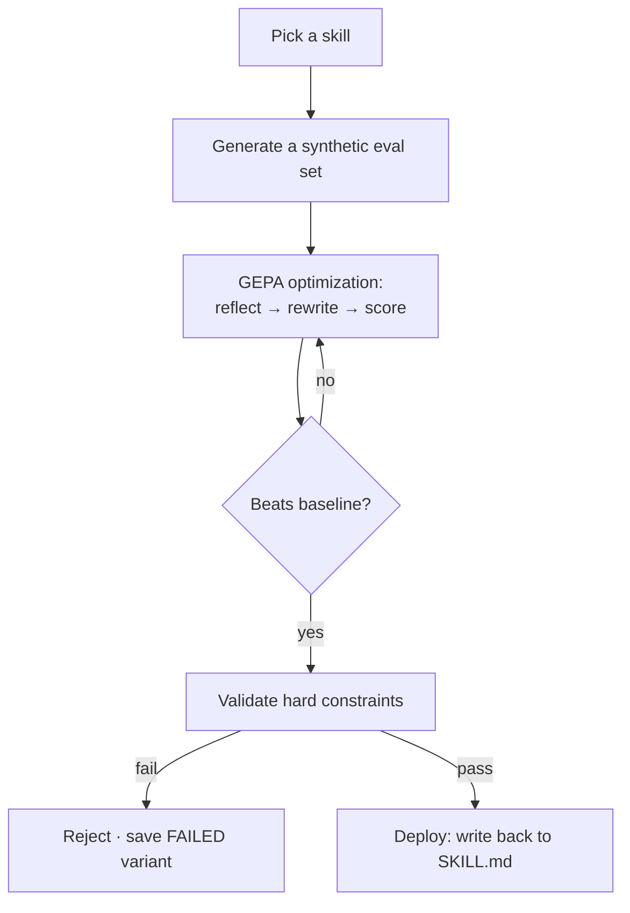

# Self-evolution

Mo's defining feature: it rewrites its own skills to get better at them, and only keeps a rewrite if it provably improves.

A **skill** is a Markdown file (`SKILL.md`) with YAML frontmatter that teaches the agent how to do something well — for example, pitfalls to avoid when generating PowerPoint files. Over time, a hand-written skill is rarely optimal. Self-evolution closes that gap automatically.

## The loop

1. **Pick a skill.** On a schedule, Mo rotates through your non–built-in skills in name order, evolving one per run so every custom skill gets attention in turn. You can also trigger a specific skill on demand.
2. **Generate an eval set.** A judge model produces a small synthetic dataset of tasks the skill should handle.
3. **Optimize (GEPA).** A reflective optimizer proposes rewrites of the skill, scores each against the eval set with an LLM-as-judge, and keeps Pareto-improving candidates over several iterations.
4. **Validate constraints.** The winning candidate must pass every hard constraint (below) or it is rejected and saved as `evolved_FAILED.md` for inspection.
5. **Deploy.** A passing variant is written back to the live `SKILL.md`.

Each run is a subprocess; its full log and result are visible in the app (`/api/mo/evolve/runs/{id}/log`).

## Constraints

A candidate is only deployable if **all** of these pass (`server/vendor/evolution/core/constraints.py`):

| Constraint | Rule |
|------------|------|
| `size_limit` | Within the absolute size cap. **Baseline-aware**: an already-large skill isn't rejected for its existing size — its ceiling is raised to `max(cap, baseline × (1 + max_growth))`. |
| `growth_limit` | Doesn't grow more than `max_prompt_growth` (default +20%) over the baseline. **Baseline-aware**: small skills get an absolute grace of `small_skill_grace_size` (default 8 KB), because +20% of a 2 KB skill is too little room for a meaningful rewrite. |
| `non_empty` | The result is non-empty. |
| `skill_structure` | Valid YAML frontmatter with `name` and `description`. |

The two baseline-aware rules matter: a flat percentage cap strangles small skills (they can't grow enough to improve) while a flat absolute cap wrongly rejects large ones. Tying both to the baseline lets a tiny skill be substantially reworked **and** keeps a large skill from ballooning.

## Configuration

The optimizer and judge models are chosen via the endpoint library (`/api/mo/models/evolve`) and stored in `~/.hermes-mo/mo-config/evolve.json`. Tune iteration count, dataset size, and constraint thresholds in `server/vendor/evolution/core/config.py` (`EvolutionConfig`).

## Why a dedicated profile

Evolution runs under a separate "evolver" profile (`~/.hermes-mo/profiles/…`) with its own seeded copy of the skills, so an in-progress optimization never interferes with the agent you're actively chatting with. Accepted variants are written back to your real skills directory.
