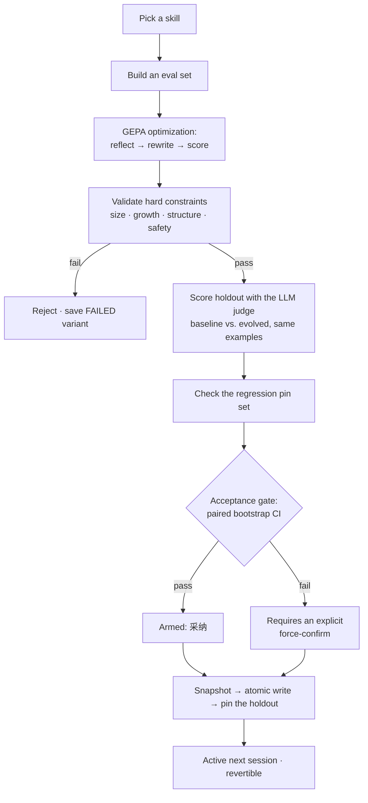

# Self-evolution

Mo's defining feature: it rewrites its own skills to get better at them, and only deploys a rewrite that provably improves.

A **skill** is a Markdown file (`SKILL.md`) with YAML frontmatter that teaches the agent how to do something well — for example, pitfalls to avoid when scraping a paginated API. Over time, a hand-written skill is rarely optimal. Self-evolution closes that gap automatically.

Two agents share the work. **小貘** (the `default` profile) does your tasks. **夜貘** (`ye-mao-evolve`) polishes the skills 小貘 uses — it reads your trajectories, picks a target, says why, and commits to a prediction that gets checked. See [What 夜貘 cannot do yet](#what-夜貘-cannot-do-yet) for the honest limits.

## The loop



1. **Pick a skill.** 夜貘 chooses — see [How 夜貘 chooses](#how-夜貘-chooses). Alphabetical rotation remains as the fallback.
2. **Build an eval set.** From your own chat history by default — see [Where the eval set comes from](#where-the-eval-set-comes-from).
3. **Optimize (GEPA).** A reflective optimizer proposes rewrites of the skill body and scores each one. The skill body *is* the optimizable parameter: it lives in the DSPy signature's `instructions`, which is what GEPA and MIPROv2 mutate.
4. **Validate constraints.** The winning candidate must pass every hard constraint (below) or it is rejected and saved as `evolved_FAILED.md` for inspection.
5. **Score the holdout.** Baseline and evolved are scored on the *same* held-out examples, always by the LLM judge — never by the cheap heuristic.
6. **Gate.** A paired bootstrap decides whether the improvement is real (below).
7. **Apply.** Accepting snapshots the current file first, writes atomically, and donates the holdout to the skill's regression pin set. Nothing auto-deploys — a human always presses the button.

Each run is a subprocess; its full log and result are visible in the app (`/api/mo/evolve/runs/{id}/log`).

## How 夜貘 chooses

Before this, the nightly loop picked alphabetically, and 夜貘's `SOUL.md` —
「我读它走过的轨迹,找出钝处」 — was written once at profile creation and read by
nothing that ran.

Now it reads its constitution, the recent 差评 turns, the skill list with usage
signal, and its own run history, and returns one of two things:

- **A plan**: which skill, why, a hypothesis about *why it's blunt*, and a
  falsifiable prediction.
- **An abstention.** With no evidence to act on, "I don't know which one to
  polish" is the correct answer, and it says so. The alternative — always
  producing a target — is how a loop starts generating noise.

Reflection is one structured call, run on its own thread: the scheduler ticks
every 30 seconds and must never block on inference. If it fails or abstains,
alphabetical rotation takes over, so a bad reflection model can't stall
evolution.

`SOUL.md` is now load-bearing. Editing it changes what 夜貘 does.

### The prediction, and why it matters

A plan commits to something like *"adding a length constraint will raise
conciseness by ≥0.10 without costing more than 0.02 of correctness"*. After the
run, that is checked against `metrics.fitness.holdout_dimensions` — judge scores
on held-out examples the prediction had no hand in choosing — and the result is
added to a running tally shown as 「夜貘的判断准确率 7/11」.

The tally is the point. A self-improving loop that only reports its own activity
drifts into what the community Hermes harness calls **bookkeeping theatre**:
tidy internal changes, no observable improvement, and no way to tell the
difference from the outside. A number that goes *down* when 夜貘 is wrong is the
cheapest available defence. If the hit rate sits at chance, the reasoning is
decoration — and you'll be able to see that.

Rules that keep the tally honest:

- **Every decidable check must hold.** A prediction with an escape hatch isn't falsifiable.
- **A missing dimension is unverifiable, not a miss.** Punishing 夜貘 for the pipeline's gaps would corrupt the signal.
- **No checks means unverifiable, not correct.** "I predict something good will happen" earns nothing.
- Unverifiable plans are counted separately — a 夜貘 that keeps making unfalsifiable predictions is telling you something too.

### The critic

GEPA proposes and GEPA's metric scores. When the optimizer and the judge are the
same weights, agreement is cheap: same blind spots, same biases, same taste in
prose on both sides of the desk.

So a critic reviews the winning rewrite on a **different** model, is told it is
not the proposer, and is asked whether the change actually addresses the
hypothesis and what it risks. If the configured critic equals the optimizer, it
refuses to run and says so rather than producing a rubber stamp.

Its verdict is advisory — an LLM's opinion is not a gate — but a `reject` makes
accepting take the same explicit confirmation as a failed statistical gate. The
gate says "the numbers don't support this". The critic says "the numbers might,
and it's still a bad idea".

## Where the eval set comes from

A synthetic eval set is generated by asking a model to read `SKILL.md` and
imagine tasks it should handle. That closes a loop on itself: the skill is
optimized against a model's imagination of the skill, and can score perfectly
while being useless to you. Nothing in it comes from what you actually asked
for, or from the answers you marked bad.

So the default is `mixed`, which mines `~/.hermes-mo/trajectories/trajectories.jsonl`
and tops up with synthetic only when too little is found.

| Source | Behaviour |
|---|---|
| `mixed` *(default)* | Real trajectories, blended with synthetic when fewer than `min_holdout × 2` usable examples are mined |
| `trajectory` | Real trajectories only. Refuses rather than inventing tasks |
| `synthetic` | The old behaviour, kept for a skill you've never used |

### What a 差评 actually means

`add_trajectory` folds every turn of a session into one trajectory carrying one
label. A 差评 on turn 5 of a 12-turn session **does not mean turns 1–4 were
bad** — you were reacting to the answer in front of you.

So the label attaches to that turn and only that turn. The eleven preceding
turns are recorded as `neg_context` and treated as unlabelled. Carrying the
label across them would send eleven perfectly good answers through the
corrective-rubric step, which is prompted with "the user marked this exchange
as unsatisfactory" — fabricating eleven failure modes, eleven rubrics that
"correct" answers that were fine, and eleven wasted LLM calls.

### Why negative examples get their rubric rewritten

`RelevanceFilter` derives `expected_behavior` partly from *the assistant's
actual response*. For a turn you rejected, that response is the bug — a rubric
derived from it would teach the optimizer to reproduce the failure.

Those turns go through `DeriveCorrectiveRubric` instead, which is told the
answer was unsatisfactory and asked what a good one *would* have done, plus a
short failure-mode tag (`ignored-length-constraint`, `wrong-tool`, …). Those
tags are what the diff modal's 依据 panel summarizes.

This inversion is the point of mining trajectories at all: GEPA's reflective
mutation only reads feedback from candidates that scored badly, so negative
examples are the highest-value signal available.

### Splitting

The holdout is sized against the gate's floor *first*, then filled
proportionally from each label stratum, and only then is the remainder split
into train and val.

Doing it the other way round — split per stratum, let the holdout be whatever
falls out — produced holdouts of 4 (or 0) from perfectly reasonable datasets.
The run would complete, spend its entire GEPA budget, and then be refused for
sample size. Every time.

The holdout must also not become all-negatives: drawn only from failures, it
measures recovery from failure rather than overall quality. Hence the
proportional fill. Shuffling is seeded, so a verdict stays reproducible from the
stored dataset.

## Scoring: a tiered LLM judge

The naive approach is to score every candidate with an LLM. That's accurate and expensive — a nightly loop with an unbounded judge is a real bill. The cheap approach is a keyword-overlap heuristic, which is free and tells you almost nothing.

Mo escalates **on failure, not on success**:

```
heuristic = 0.3 + 0.7 × |expected ∩ output| / |expected|

heuristic ≥ 0.85  →  return it, no LLM call
heuristic <  0.85  →  LLM judge: correctness / procedure-following / conciseness
                       + textual feedback
```

The reason this works is specific to GEPA: its reflective mutation only *reads* the feedback attached to candidates it wants to improve — the low scorers. Judging a candidate that already scored 0.9 buys nothing. So essentially the whole judge budget lands on the examples GEPA actually learns from, at roughly a third of an always-judge run's cost.

Guards, all in `server/mo_evolve/metric.py`:

- **Cache** keyed on `sha256(task_input ‖ output ‖ skill_text)`. GEPA re-evaluates the same candidate on the same valset repeatedly, so the hit rate is high.
- **Hard call cap** (default 4× the metric budget) on *search* scoring; past it, scoring degrades to the heuristic and `capped` is recorded. Holdout scoring deliberately ignores the cap — it's a handful of examples and it's the only thing the gate reads.
- **Failure containment**: a judge exception falls back to the heuristic. If more than 30% of judge calls fail, the run is marked `degraded` and **the gate refuses it** — a run scored by a broken judge must never be one click from deployment.
- **Scale purity on the holdout.** The gate subtracts baseline from evolved *per example*. A keyword-overlap score on one side of that subtraction and a judged score on the other manufactures a delta out of nothing (a heuristic 1.0 against a judged 0.9 reads as +0.10 on identical text). So a single holdout fallback sets `holdout_fallbacks` and marks the run degraded, even at n=1.
- **Collusion warning**: if the judge model equals the optimizer model, `collusion_risk` is set and the UI says so. The same model has the same blind spots on both sides of the desk.

The run's `metrics.json` records `metric_mode`, judge call counts, cache hits, and per-dimension holdout scores, so a "+0.083" in the UI can always be traced to how it was produced.

## Constraints

A candidate is only deployable if **all** of these pass:

| Constraint | Rule |
|------------|------|
| `size_limit` | Within the absolute size cap. **Baseline-aware**: an already-large skill isn't rejected for its existing size — its ceiling is raised to `max(cap, baseline × (1 + max_growth))`. |
| `growth_limit` | Doesn't grow more than `max_prompt_growth` (default +20%) over the baseline. **Baseline-aware**: small skills get an absolute grace of `small_skill_grace_size` (default 8 KB), because +20% of a 2 KB skill is too little room for a meaningful rewrite. |
| `non_empty` | The result is non-empty. |
| `skill_structure` | Valid YAML frontmatter with `name` and `description`. |
| `injection_scan` | No high-severity pattern in the lines this rewrite **added**. |
| `frontmatter_frozen` | The YAML frontmatter is byte-identical to the baseline. |

The two baseline-aware rules matter: a flat percentage cap strangles small skills (they can't grow enough to improve) while a flat absolute cap wrongly rejects large ones. Tying both to the baseline lets a tiny skill be substantially reworked **and** keeps a large skill from ballooning.

### Why the safety scan is diff-scoped

Evolved text is written by a model into a file the agent later loads. But scanning the whole file would make a skill *about* shell scripting or prompt injection permanently un-evolvable — it legitimately contains `rm -rf` and "ignore previous instructions". What's suspicious is text the optimizer **introduced**, so only added lines are scanned (`server/mo_evolve/safety.py`).

High severity blocks the run: instruction-override phrasing, identity override, system-prompt exfiltration, chat-template tokens (`<|im_start|>`), `curl … | sh`, `rm -rf /`, and credential shapes. Medium severity warns in the diff view: newly-introduced external URLs, long base64 blobs, absolute paths outside `$HOME`.

Both severities are rendered in the diff modal. A run blocked by a high-severity finding writes `evolved_FAILED.md` plus `failed_constraints.json` next to it — a run rejected *for* an injection finding is exactly the one whose findings someone needs to read.

### Why frontmatter is frozen

`vendor/hermes-agent/agent/system_prompt.py` builds the always-on skills index from frontmatter `name` + `description` only; bodies load on demand via `skill_view`. Frontmatter is therefore the one part of a skill that lands in **every** system prompt unconditionally.

It survives evolution today because `reassemble_skill()` happens to preserve it — an accident of implementation. `frontmatter_frozen` turns that into an enforced invariant. Rewriting the body is the point of evolution; rewriting the always-on index is a much larger blast radius, and if we ever want it, it should be a separate, explicitly-gated feature.

## The acceptance gate

`improvement > 0` is not evidence. On a handful of holdout examples, one lucky sample moves the mean; a greedy "keep it if the score went up" loop is the agent p-hacking itself.

A candidate arms the accept button only if **all** hold (`server/mo_evolve/gate.py`):

| Check | Rule |
|---|---|
| Sample size | `n ≥ min_holdout` (default 5) |
| Effect | The 95% **paired bootstrap** CI lower bound on the mean holdout delta exceeds `min_effect` (default 0.02) |
| Regression | No pin regresses by more than `regression_tolerance` (default 2%) |
| Judge health | The run is not `degraded` — no widespread judge failures, and no holdout score fell back to the heuristic scale |

Paired, because the pipeline scores both variants on the *same* holdout examples — resampling over pairs preserves that correlation and has far more power at n≈5–10 than an unpaired test. The bootstrap is seeded, so a verdict is reproducible from the stored scores.

A failing gate does **not** hide the candidate. It turns 采纳 into a two-step force-confirm: you can still deploy a regression, but never by a single stray click, and the run records `forced: true`.

### Regression pins: benchmarks as gates, not fitness functions

Every accepted run donates its holdout examples to `evolve/pins/<skill>.jsonl`. Future candidates for that skill are re-scored against the accumulated pins and may not regress on them.

This is a ratchet: a rewrite that improves this week's rubric while breaking something last month's rewrite got right is rejected. It needs no external benchmark and no new infrastructure — the pins are just the evidence from runs you already approved. Capped at 50 examples, oldest evicted.

## Applying, reverting, and the no-hot-swap rule

Accepting a run:

1. **Staleness check.** If the live `SKILL.md` no longer matches the run's `baseline_skill.md`, the accept is refused. A nightly run started at 03:00 and accepted at 18:00 would otherwise silently discard every hand edit made in between.
2. **Gate check.** Refused unless passing, or forced.
3. **Snapshot.** The current contents are archived as `vNNNN.md` before anything is overwritten.
4. **Atomic write.** Temp file + `os.replace`. A torn `SKILL.md` is worse than a stale one — a half-written frontmatter block breaks skill discovery entirely.
5. **Pin the holdout.**
6. **Mark pending.**

Every version is listed in the app with a one-click revert, and a revert is itself snapshotted first, so revert-of-revert works.

**No hot-swap.** An in-flight session has already built its prompt prefix; `system_prompt.py` notes that changing a stable-tier input mid-session busts the static-prefix rebuild and drops the request to an uncached layout. The next `skill_view` in that conversation would also return text the turn wasn't planned against. So the UI reports 「下次新会话生效」 rather than implying the running conversation just changed underneath you.

## What 夜貘 cannot do yet

Being straight about the current limits, because the UI's poetry is easy to over-read:

- **夜貘 cannot author, split, or retire a skill.** It can only rewrite the body of one that already exists. A cluster of failures with no covering skill is invisible to it.
- **Its reasoning is one LLM call, not an agent turn.** It sees a summary someone else assembled; it cannot go read a skill or grep a session to check a hunch. (`hermes --profile ye-mao-evolve chat -q` would give it a real turn with tools — that's the intended route for on-demand use, not the nightly loop.)
- **The critic is one opinion, not a panel**, and it reviews the winner rather than the search.
- **Nothing here is verified end-to-end against a live model.** The unit tests cover the decision logic with the LLM faked; the cost and quality of a real run are not yet measured.

## Configuration

Optimizer and judge models are chosen via the endpoint library (`/api/mo/models/evolve`) and stored in `~/.hermes-mo/mo-config/evolve.json`. Tune iteration count, dataset size, judge tiering, and gate thresholds in `server/vendor/evolution/core/config.py` (`EvolutionConfig`).

## Where the code lives

| Path | Contents |
|---|---|
| `server/mo_evolve/` | Mo-original: `store` (run state), `reflect` (target choice + plans), `verify` (prediction scoring + calibration), `critic` (cross-model review), `trajectory_importer` / `trajectory_dataset` (mining), `metric` (tiered judge), `gate` (bootstrap + pins), `safety` (scan), `skill_archive` (versions + revert), `accept` (guarded apply). Importable and unit-tested. |
| `server/vendor/evolution/` | The GEPA engine, vendored from NousResearch/hermes-agent-self-evolution (MIT) with Mo's local patches — see `server/vendor/README.md`. |
| `server/tests/` | `pytest server/tests`. No test touches the network or a real `~/.hermes-mo`. |
| `server/mo-gateway.py` | Route handlers only; they delegate to `mo_evolve`. |

Upstream's phase 4 (evolving tool *implementation code* via the Darwinian Evolver) is deliberately **not** implemented: that tool is AGPL v3, and Mo neither imports, vendors, nor ports it.

## Why a dedicated profile

Run bookkeeping — history, schedule, archive, pins — lives under a separate "evolver" profile (`~/.hermes-mo/profiles/ye-mao-evolve/`), so it never mixes with your chat sessions.

Note that evolution reads and writes your **live** skills directory (`~/.hermes-mo/skills`), not a copy. That's deliberate: a skill you authored five minutes ago is immediately evolvable, and accepting writes back to the file you own. Isolation comes from the staging → review → accept flow, not from a separate skills tree: a candidate sits in the run's output directory until you approve it.
